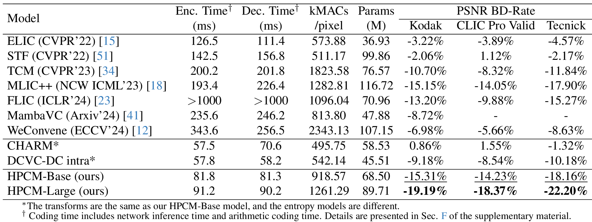

# Learned Image Compression with Hierarchical Progressive Context Modeling [ICCV 2025]

## Introduction

This repository is the official Pytorch implementation of the paper "Learned Image Compression with Hierarchical Progressive Context Modeling".

**Abstract:** Context modeling is essential in learned image compression for accurately estimating the distribution of latents. While recent advanced methods have expanded context modeling capacity, they still struggle to efficiently exploit long-range dependency and diverse context information across different coding steps. In this paper, we introduce a novel Hierarchical Progressive Context Model (HPCM) for more efficient context information acquisition. Specifically, HPCM employs a hierarchical coding schedule to sequentially model the contextual dependencies among latents at multiple scales, which enables more efficient long-range context modeling. Furthermore, we propose a progressive context fusion mechanism that incorporates contextual information from previous coding steps into the current step, effectively exploiting diverse contextual information. Experimental results demonstrate that our method achieves state-of-the-art rate-distortion performance and strikes a better balance between compression performance and computational complexity.

## Highlights

Our **H**ierarchical **P**rogressive **C**ontext **M**odeling (**HPCM**) entropy model significantly advances the performance of Learned Image Compression (LIC) models with the key insights:

- Efficient global-local context modeling with Hierarchical Coding Schedule.
- Exploring rich context information effectively through Progressive Context Fusion.

Our method achieves **state-of-the-art** compression performance gains on **Kodak (-19.19%)**, **CLIC (-18.37%)**, and **Tecnick (-22.20%)** over VTM-22.0.

## Performance



## Pretrained Model

HPCM-Base models:

| Lambda | Metric | Link | Lambda | Metric  | Link |
| ------ | ------ | ---- | ------ | ------- | ---- |
| 0.0018 | MSE    | Link | 2.4    | MS-SSIM | Link |
| 0.0035 | MSE    | Link | 4.58   | MS-SSIM | Link |
| 0.0067 | MSE    | Link | 8.73   | MS-SSIM | Link |
| 0.013  | MSE    | Link | 16.64  | MS-SSIM | Link |
| 0.025  | MSE    | Link | 31.73  | MS-SSIM | Link |
| 0.0483 | MSE    | Link | 60.5   | MS-SSIM | Link |

HPCM-Large models:

| Lambda | Metric | Link | Lambda | Metric  | Link |
| ------ | ------ | ---- | ------ | ------- | ---- |
| 0.0018 | MSE    | Link | 2.4    | MS-SSIM | Link |
| 0.0035 | MSE    | Link | 4.58   | MS-SSIM | Link |
| 0.0067 | MSE    | Link | 8.73   | MS-SSIM | Link |
| 0.013  | MSE    | Link | 16.64  | MS-SSIM | Link |
| 0.025  | MSE    | Link | 31.73  | MS-SSIM | Link |
| 0.0483 | MSE    | Link | 60.5   | MS-SSIM | Link |

## R-D Data

#### HPCM-Base, Kodak, PSNR

```
bpp = [0.1211, 0.1757, 0.2729, 0.4125, 0.5898, 0.8209]
psnr = [29.4022, 30.7547, 32.4012, 34.2063, 36.0145, 37.7525]
```

#### HPCM-Base, Kodak, MS-SSIM

```
bpp = [0.0974, 0.1447, 0.2124, 0.2958, 0.4082, 0.5724]
db_msssim = [13.2883, 14.8748, 16.5800, 18.1826, 19.7679, 21.4763]
```

#### HPCM-Large, Kodak, PSNR

```
bpp = [0.0951, 0.1537, 0.2438, 0.3778, 0.5516, 0.7843]
psnr = [28.9135, 30.4490, 32.1219, 33.9923, 35.8511, 37.7480]
```

#### HPCM-Large, Kodak, MS-SSIM

```
bpp = [0.0958, 0.1438, 0.2090, 0.2935, 0.4016, 0.5577]
db_msssim = [13.2503, 14.9292, 16.6119, 18.2272, 19.7947, 21.4393]
```

## Acknowledgement

Part of our code is implemented based on [CompressAI](https://github.com/InterDigitalInc/CompressAI) and [DCVC-DC](https://github.com/microsoft/DCVC/tree/main/DCVC-family/DCVC-DC). Thanks for their excellent work!

## Citation

```
@inproceedings{li2025hpcm,
  title={Learned Image Compression with Hierarchical Progressive Context Modeling}, 
  author={Li, Yuqi and Zhang, Haotian and Li Li and Liu, Dong},
  booktitle={IEEE/CVF International Conference on Computer Vision (ICCV)}, 
  year={2025},
}
```

## Contact

If you have any questions, please feel free to contact lyq010303@mail.ustc.edu.cn.
